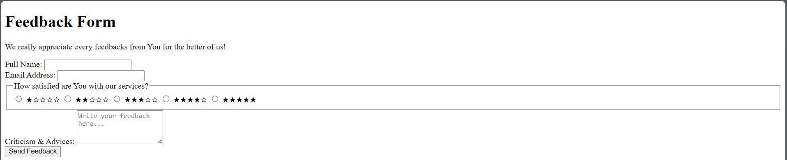
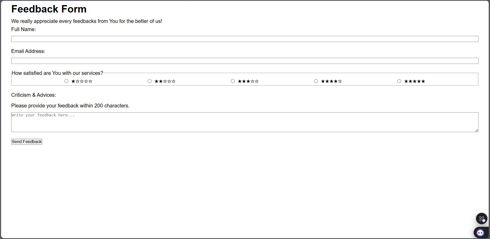
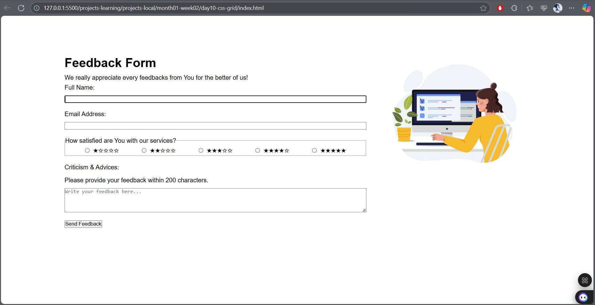
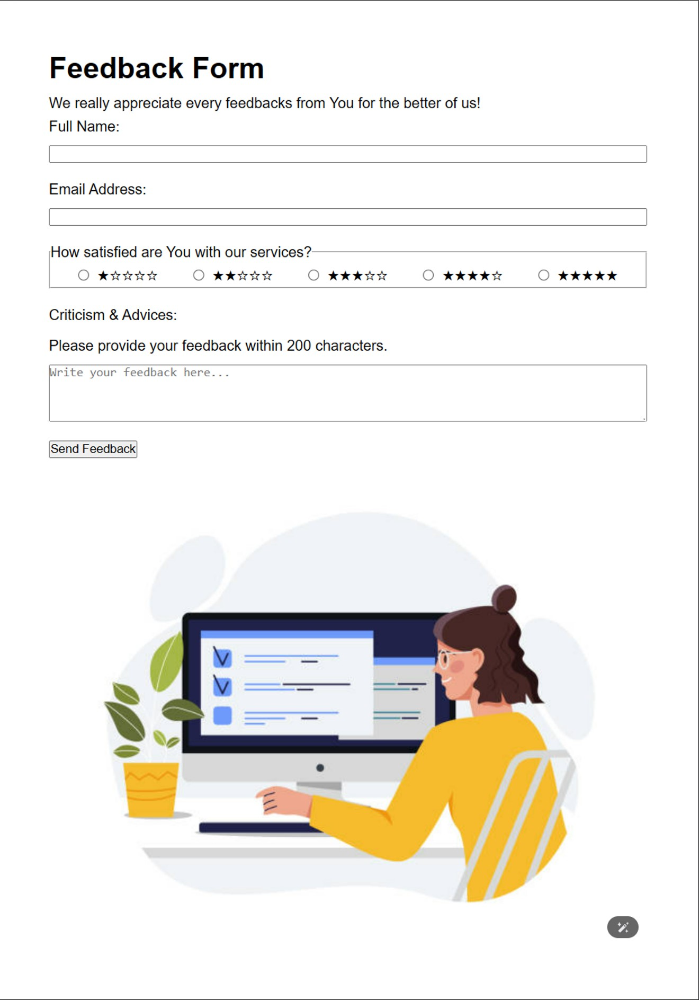
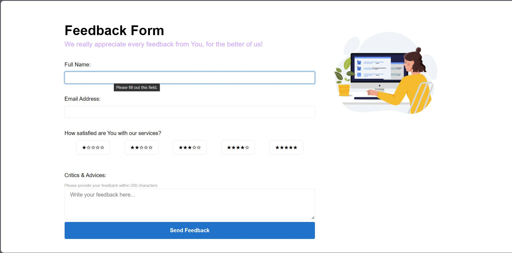

 

# "Feedback Form Web Page"   - Misael's 2nd F. End Learning Project 

Hello... 😃👋🏻  
It's me Misael (_ElMyosotisCode_) your future Front End Developer Expert.

This project is my second learning project in the field of Front End Dev. As stated in the title, this project is about a single web-page containing dummy Feedback Form.

---

## 🗺️ Roadmap

So here are my plans for this learning project...  
⚠️ _May change in the future_

 

🎯 **_Phase 1 : Barebone Structure (HTML)_**
* ☑ **HTML** | Base structure & Semantics

    * Build the form framework with semantic tags (`form`, `fieldset`, `label`, etc.).

 

🎯 **_Phase 2 : Visual Styling (CSS)_**
* ☑ **CSS** | Global Styling & Variables

    * Set up global styles and `CSS` variables for consistent theming.

* ☑ **CSS** | Input & Label Alignment
    * Adjust the layout for each input group. Possibly use `Flexbox` to arrange all `label` and all `input` neatly and responsively.

* ☑ **CSS** | Form Container Layout

    * Create a “_card view_” for the form so that it is centered on the page using `max-width`, `margin: auto`, and `box-shadow`.

* ☑ **CSS** | Custom Radio Button Styling

    * Hide the default radio button display and style the `label` to create a customizable, clickable star rating.

* ☑ **CSS** | Input, Textarea & Button Styling

    * Styling `input` and `textarea`. Also, redesigning the “_Submit_” `button` to make it more appealing with `:hover` and `:active` state effect.

---

## 🛠️ Development Log / Project Journal

### Project Progress Session 1 - HTML Form Basic Structure
📅 _**Date:** 2025-07-23_

 

💬 In this initial session, the main focus is on building the structural foundation of the feedback page using pure semantic `HTML`. 
The result is a page that is functional in terms of structure, albeit without visual styling.

* 📍 **Complete Form Structure**

    * Successfully created a dummy form structure that includes inputs for _name, email,_ a _5-star rating options_, and a text area for _feedback messages_.

* 📍 **Semantic Grouping**

    * Using `fieldset` and `legend` to group hte _5 star rating options_, providing better context for users and screen readers.

* 📍 **Browser Basic Validation**
    
    * Implemented simple client-side `validation`. 

    * The form now automatically checks whether _required fields_ have been filled in and whether the _email_ format is correct before it can be sent.

 

### Web Page Visual in Project Progress Session 1 📸

- - - - -

### Project Progress Session 2 - HTML Basic A11y and CSS Flexbox
📅 _**Date:** 2025-07-28_

 

💭 In this progress session, I began to apply _`CSS`_ to transform the form from a pure structure into a neatly arranged layout that is easier to use. The foundation for the visual design system also began to take shape.

* 📌 **CSS Design System**

    * Setting up a framework for the design system in CSS, including variables for color schemes, typography scales, and spacing systems (8-Point Grid) for consistency across the project.

* 📌 **Vertical Layout Arrangement**

    * Applied _`Flexbox layout`_ to arrange each input group (label and form) vertically, creating a clear filling flow.

* 📌 **Horizontal Layout Arrangement**

    * Added semantically linked text cues to the message area to provide additional context for _screen reader_ users.

* 📌 **Accessibility Enhancements (a11y)**
    * Added semantically linked text cues to message areas using the `aria-describedby` attribute provides crucial additional context for _screen reader_ users.

 

### Web Page Visual in Project Progress Session 2 📸

- - - - -

### Project Progress Session 3 - CSS Grid Layout
📅 _**Date:** 2025-07-30_

 

💬 This session marks a visual upgrade of the page. The focus is on moving from a simple linear flow to a modern multi-column structure suitable for desktop viewing, using the power of `CSS Grid`.

* 📍 **Main Layout Transformation**

    * Successfully changed the page from a single vertical column to a _professional two-column layout_, significantly improving the user experience on wider screens.

* 📍 **Content Separation (_Form and Illustration_)**

    * This new layout strategically places the main form content in the left column and an attractive illustration in the right column, _creating visual balance_.

* 📍 **Centered View**

    * The entire layout is now _centered horizontally_ on the page with maximum width.

    * Created a better visual and focused “_card-view_” feel, which no longer spreads across the screen.

 

### Web Page Visual in Project Progress Session 3 📸

- - - - -

### Project Progress Session 4 - CSS Grid | Responsive Design
📅 _**Date:** 2025-08-06_

 

💭 In this progress session, I evolved my static web-page into a more responsive display where I use a universal design that works on any screen sizes. Built upon the existing `CSS Grid` structure, this update introduces the **Mobile-First** methodology, _ensuring a seamless and optimal user experience across all screen sizes_, from mobile phones, small tablets to widescreen desktops.

* 📌 **Mobile-First Layout Methodology**

    * Refactored the `CSS` to establish a _single-column layout as the default view_. This approach _prioritizes the mobile experience_, ensuring fast load times and perfect content rendering on smaller devices.

* 📌 **Adaptive Layout through `Media Queries`**

    * Implemented `CSS @media queries` to introduce a multi-column layout on larger screens. The design now intelligently "jumps" from a single column to a two-column grid at a 768px breakpoint, _adapting the structure to the available screen dimensions._

* 📌 **Improved Fluid-Grid Implementation**

    * Enhanced the grid's column definition using the `minmax()` function (`grid-template-columns: 2fr minmax(250px, 1fr);`). Through this technique, I can ensure the illustration column never shrinks below a minimum width, while still allowing it to grow flexibly, _solving a key visual consistency challenge on mid-sized screens_.

 

### Web Page Visual in Project Progress Session 4 📸

- - - - -

### Project Progress Session 5 - UI Polishing and Finalization
📅 _**Date:** 2025-08-13_

 

💬 This session ...

📍 This final session improves the project from a functional prototype to be more a polished version, production-ready web page. The focus was on elevating the user experience through UI/UX enhancements and ensuring the highest code quality.

* 📌 **Enhanced Interactive Components**

    * The form is now significantly more engaging. All interactive elements, including text inputs, radio buttons, and the submit button, now _provide clear visual_ feedback through `:hover`, `:focus`, and `:checked` states with smooth `CSS transitions`.

* 📌 **Custom-Styled Rating System**

    * Replaced the standard radio buttons with a fully custom, clickable star rating system. This not only _improves the aesthetics but also creates a more intuitive and satisfying way for users to provide feedback_.

* 📌 **Professional Code Validation**

    * The entire codebase has been meticulously reviewed and validated. The final HTML and CSS now fully comply with W3C standards, _ensuring maximum browser compatibility_ and professional-grade quality.

### Web Page Visual in Project Progress Session 5 📸

---

## 💡 Points of Key Learnings

### Learning Module Session 6 ~ HTML Form Basic Structure

 

📚 Here are some key points I learned through this session:

* 🔸 **Structure & Semantic (HTML Architecture)**

    * Understand the use of basic `HTML form` tags such as `<form>`,  `<input>`, `<textarea>`, and `<button>` to create a functional form structure.

    * Make use of `<fieldset>` and `<legend>` to group related elements (such as rating options), which significantly improves structural clarity and accessibility.

* 🔸 **Accessibility & UX**

    * Implemented a "_sacred pairing_" between `<label>` and `<input>` elements using their `for` attribute to improve accessibility and user experience.

    * With that, I can ensure that each input can be clearly identified by _screen readers_ and allows users to click on the label to activate the input.

* 🔸 **Data Handling & Validations**

    * Learned about the crucial role of the `name` attribute as a key for data sent to the server and for grouping `radio buttons` into a single exclusive option.

    * How to implement _client-side validation_ without `JavaScript`, but only using `HTML5` attributes: 

        * 🟣 `required` : to ensure mandatory fields are filled.

        * 🟣 `type="email"` : to validate email format.

        * 🟣 `maxlength=200` : to limit the length of the feedback message.

- - - - -

### Learning Module Session 7 ~ HTML Basic A11y and CSS Flexbox

💡 Here are some key points I learned through this session:

* 🔹 **CSS Architecture & Design System**

    * Building a **Single Source of Truth** for design values by utilizing `CSS Variables` inside `:root` segment of `CSS` file. I created a comprehensive variable system, such as:

        * 🟡  **8-Point Spacing System (`--space-sm`, etc)** : to ensure that all _content spacing_ (`margin`, `padding`, `gap`) is consistent.

        * 🟡  **Typography Scale (`--font-size-base`, etc)** : to define a clear _font size scale_ (`--font-size-base`, etc.) for a regular visual hierarchy.

        * 🟡  **Color Palette (`--color-primary`, etc)** : to _store all project colors_ as variables for ease of future themes and changes. 

* 🔹 **Flexbox Layout for Responsive Design**

    * Utilized `Flexbox` as a `CSS` tool for efficiently **arranging component layouts**. I apply it in two main scenarios:

        * 🟡 **Vertical Column Layout** : By using `display: flex` with `flex-direction: column` on the input group to _stack all of the `label` above the form_, it creates a logical filling flow.

        * 🟡 **Horizontal Row Layout** : In applying `flex-direction: row` to the rating group to _align all star options_, and using `justify-content` to _distribute all star options evenly_.

* 🔹 **Accessibility Enhancement (`A11y`)**

    * Applied the `aria-describedby` attribute to _link text hints to textareas_. This is a step beyond standard labels, _providing screen reader users_ with additional descriptive context (not just names), _significantly enriching their experience_.

- - - - -

### Learning Module Session 8 ~ CSS Grid Layout

📚 Here are some key points I learned through this session:

* 🔸 **Fundamental Concepts: _Grid Container_ & _Grid Items_**
    
    * Understanding the concept of `CSS Grid` by associating the `CSS Grid` model with a “bookshelf” system, where there is one _Grid Container_ (`.page-container`) that acts as the ‘shelf’ and several _Grid Items_ (`<main>, <aside>`) that act as the “books” on it.

    * Enabling _Grid mode_ with the essential property `display: grid` on the container element

* 🔸 **Defining Layout Blueprint**

    * Understanding the `grid-template-columns` property _to define the column structure_. This is the “blueprint” of the layout.

    * Analyzing the advantages of `fr` (fractional unit), which intelligently _distributes available space_ and automatically _calculates `gap`_, makes it far superior and problem-free compared to manual calculations using `%` or fixed unit like `rem` or `px`.

    * Applying the `gap` property to _create consistent and neat spacing_ (gutter) between grid items without requiring additional `margin` property.

* 🔸 **Professional Design Pattern: _Centered Container_**

    * Implementing the “Centered Container” design pattern by combining `max-width` and `margin: auto` on the Grid Container.

    * A very important technique for _improving readability_ and giving a more premium design feel, as the content does not spread across the entire screen on large monitors.
 
* 🔸 **Visual Summary Table**
    * As a quick reference, the following table will maps out the key concepts of CSS Grid that have been written:

| Concept   | Properties for the Container                       | Properties for the Items           | Analogy                  |
| :-------- | :------------------------------------------------- | :--------------------------------- | :----------------------- |
| **Blueprint** | `display: grid`, `grid-template-columns`, `grid-template-rows`, `gap` | -                                  | Building a bookshelf.    |
| **Placement** | -                                                  | `grid-column`, `grid-row`            | Put the books on shelves.|
| **Alignment** | `justify-items`, `align-items`                     | `justify-self`, `align-self`         | Straighten the books.    |

    <i><b>Table Key Learnings 8.1</b> - CSS Grid Simple Concept</i>

 

- - - - -

### Learning Module Session 9 ~ CSS Grid Layout | Responsive Design

💡 Here are some key points I learned through this session:

* 🔹 **Core Philosophy: _Mobile-First Design_**

    * Understand the _Mobile-First_ approach, a fundamental best practice in modern web development. This involves _writing the simplest CSS for the smallest screens first_, then _progressively adding complexity for larger screens_ using `@media queries`. This method results in lighter, faster-loading code for mobile users and a more maintainable codebase.

* 🔹 **Conditional Styling with _Media Queries_**

    * Learned to use `@media queries` as a conditional "gatekeeper" for CSS rules. Specifically using `min-width` to _apply styles only when the screen width exceeds a certain threshold_ (breakpoint).

    * Explored creating ranged media queries (e.g., `@media (min-width: 768px)` and `(max-width: 1024px)`) to _apply styles within a specific viewport interval_, allowing for precise, surgical adjustments.

* 🔹 **Grid Technique: _The `minmax()` Function_**

    * Discovered the powerful `minmax(MIN, MAX)` function as _a solution for creating truly robust and fluid grid columns_.

    * By defining a column with `minmax(250px, 1fr)`, I was able to _enforce a minimum width for an element while still allowing it to grow flexibly_. This technique is superior to applying `min-width` directly to a child element as it makes the grid container itself "smarter", preventing content overflow and maintaining layout integrity.

- - - - -

### Learning Module Session 10 ~ UI Polishing and Finalization

📚 Here are some key points I learned through this session:

* 🔸 **`CSS` Pseudo-classes: The Language of User Interaction through `CSS`**

    * Learned that pseudo-classes like `:hover`, `:focus`, and `:checked` are not mere decorations, they are also the _fundamental language where the web-UI communicates with the user_.

        * **`...:hover`**: _Signals to the user that "Oh... The element is interactive and can be clicked"_. Implemented on the submit button and rating labels to invite interaction.

        * **`...:focus`**: _Signals the user that "Oh... I am currently at this element."_ Crucial for accessibility and user orientation, this was implemented on all input fields with a subtle box-shadow to provide a clear.

        * **`...:checked`**: _Signals the user that "Ah... I have selected this option, and now it's already registered on the page."_ This was the cornerstone of the custom radio button implementation, _providing persistent visual confirmation of the user's choice_.

* 🔸 **`CSS`-Only Radio Button Styling and Interactivity**

    * Learned the pattern for creating _custom-styled form controls with only "pure `CSS`"_ by decoupling the element's functionality from its appearance.

        * **The Invisibility**: Learned _the correct way to hide the default `input[type="radio"]` while keeping it functional_. With utilizing `position: absolute` and `opacity: 0` attributes, the visibility of corresponding element can be removed, without using `display: none`, which would kill its accessibility and functionality.

        * **The `CSS` Sibling Combinator (`+`)**: Understood the logic of the Adjacent Sibling Selector (`input:checked + label`). It's _a conditional rule, or more precisely it's an "**IF and ONLY IF**" situation_. Or we can say, "**IF** the input is in a `:checked` state, **THEN** (and only then) apply a specific style to its direct sibling, which is the label.

* 🔸 **Web Codes Validation: A "Quality Assurance"**

    * Through `HTML5` and `CSS3` codes validation, the goal of producing robust, professional, and cross-browser compatible code can be achieved.
    
        * **Catching Subtle Errors**: The validator helped identify and correct subtle syntax issues that are easily missed by the human eye but can have technical implications. This included fixing invalid `HTML5` / `CSS3` structures, and removing unwanted or legacy method, for bringing the code up to modern standards.
        
---

**_Updated on : 2025, Aug. 13th_**

